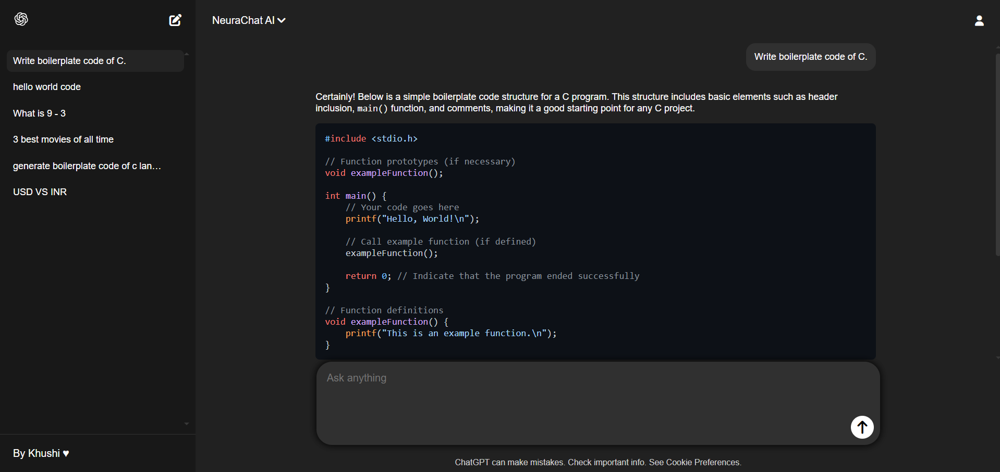

# NeuraChat AI

[]()
[]()
[]()
[]()
[]()
[]()

**NeuraChat AI** is an intelligent, full-stack chat application developed by **Khushi Mohammd**. It uses OpenAI's GPT models to deliver real-time, conversations in a modern, multi-threaded chat interface. This project demonstrates my expertise in **React**, **Node.js**, **Express**, **MongoDB**, and **API integration**, and is designed to provide a seamless and engaging user experience.

---

## Live Demo

Check out the live version of NeuraChat AI here: [NeuraChat AI Live Demo](https://neurachat-ai.onrender.com/)

**Please note:** This project currently uses OpenAI’s free tier for API access. To ensure fair usage and prevent service interruptions, kindly avoid excessive or automated use.

Thank you for your understanding and support!

---

## Screenshots



---

## Table of Contents

- [Project Highlights](#project-highlights)
- [Technologies Used](#technologies-used)
- [Getting Started](#getting-started)
- [About My Work](#about-my-work)
- [Future Improvements](#future-improvements)
- [Open to Contributions](#open-to-contributions)
- [License](#license)
- [Acknowledgments](#acknowledgments)

---

## Project Highlights

- **Real-time AI Chat:** Communicate with OpenAI’s GPT models for instant, intelligent responses.
- **Multi-Threaded Conversations:** Start, switch, and manage multiple chat threads, each with its own history.
- **Persistent Storage:** All chat threads and messages are stored in MongoDB, so your conversations are never lost.
- **Modern UI:** Clean interface built with React and custom CSS.
- **Markdown & Code Support:** AI responses support markdown formatting and syntax-highlighted code blocks.
- **Smooth User Experience:** Fast, intuitive, and optimized UI.

---

## Technologies Used

- **Frontend:** React, Vite, Context API, CSS
- **Backend:** Node.js, Express, Mongoose
- **Database:** MongoDB Atlas
- **AI Integration:** OpenAI API
- **Other:** React Markdown, Rehype Highlight

---

## Getting Started

### 1. Clone the Repository

```sh
git clone https://github.com/Khushi-Mohammd/NeuraChat-AI.git
cd NeuraChatAI
```

### 2. Backend Setup

```sh
cd Backend
npm install
```

- Create a `.env` file with your credentials:
  ```
  OPENAI_API_KEY=your-openai-key
  MONGODB_URL=your-mongodb-uri
  ```
- Start the backend server:
  ```sh
  npm run dev
  ```

### 3. Frontend Setup

```sh
cd ../Frontend
npm install
npm run dev
```

- Open [http://localhost:5173](http://localhost:5173) in your browser.

---

## About My Work

NeuraChat AI is a demonstration of my ability to:

- Build robust full-stack applications from scratch.
- Integrate third-party APIs (OpenAI).
- Design and implement RESTful APIs.
- Manage state and context in React.
- Create responsive, user-friendly interfaces.
- Work with NoSQL databases (MongoDB).

---

## Future Improvements

- **Mobile Responsiveness:** The current UI is optimized for desktop. I plan to enhance the design for seamless mobile and tablet experiences.
- **User Authentication:** Add user accounts for personalized chat history and secure access.
- **Customizable AI Settings:** Allow users to adjust AI parameters for tailored responses.
- **Enhanced Error Handling:** Improve feedback for API errors and connectivity issues.
- **Voice Input/Output:** Integrate speech-to-text and text-to-speech for hands-free chatting.
- **Light Mode:** Add a toggle for light/dark themes.

---

## Open to Contributions

NeuraChat AI is an open project, and contributions are welcome! If you have ideas for new features, improvements, or bug fixes, feel free to open an issue or submit a pull request. Whether you’re a beginner or an experienced developer, your input is valued.

**How to contribute:**

1. Fork the repository
2. Create a new branch for your feature or fix
3. Commit your changes with clear messages
4. Open a pull request describing your changes

Let's build something amazing together!

---

## License

This project is licensed under the MIT License — you are free to use, modify, and distribute it, provided that credit is given to the original author.
See the [LICENSE](LICENSE) file for full details.

---

## Acknowledgments

- [OpenAI](https://openai.com/) for the API.
- [React](https://reactjs.org/) for the frontend framework.
- [MongoDB](https://www.mongodb.com/) for the database.

---

Made with ❤️ by Khushi Mohammd
